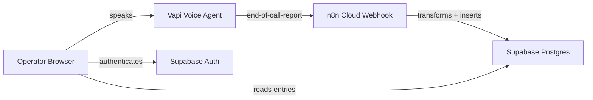
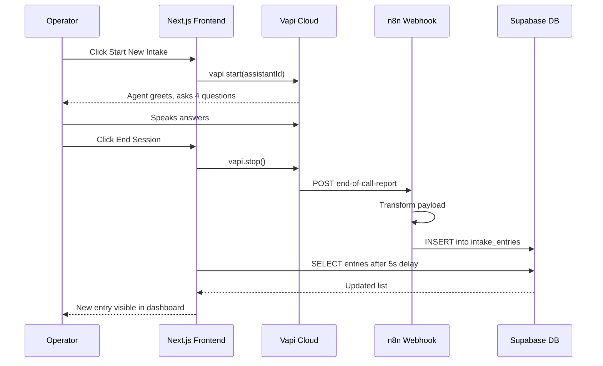
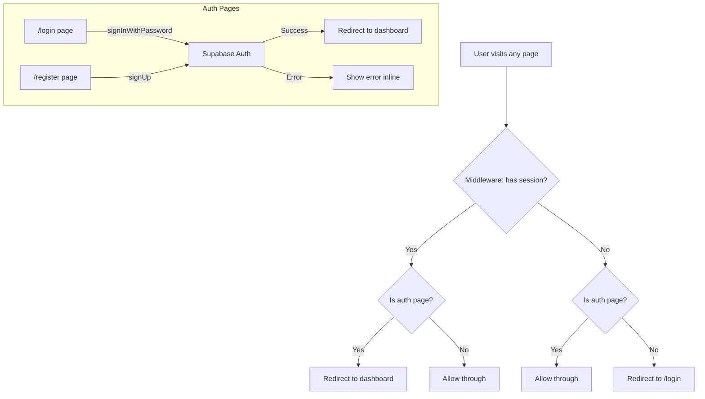
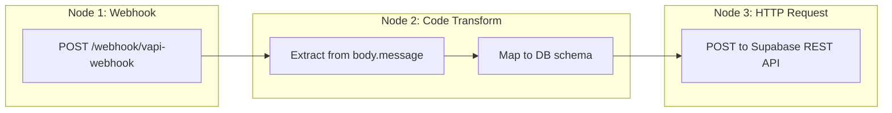
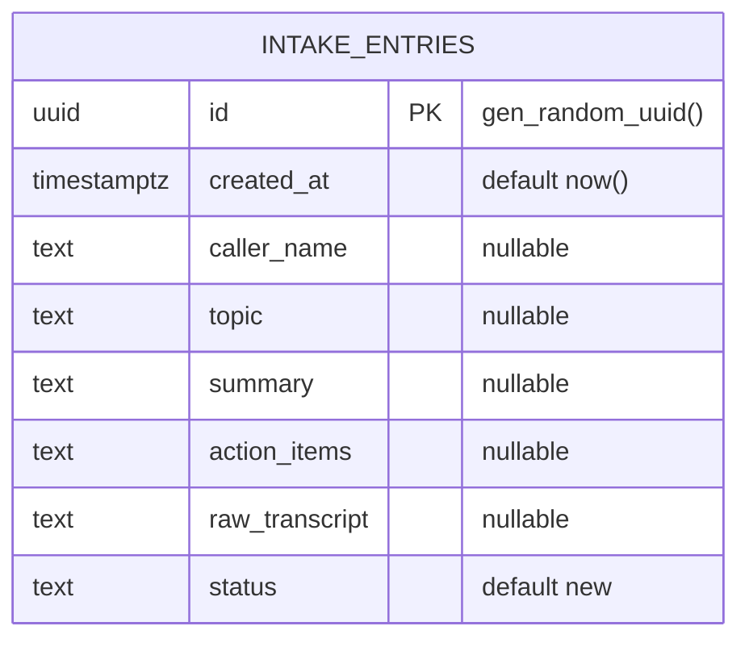

# Internal Voice Intake Tool

Operators log information by speaking to a voice agent in the browser. Sessions are transcribed, structured into fields, and stored in a database. A protected dashboard shows all entries with inline status management.

**Flow:** Operator speaks > Vapi transcribes > n8n transforms > Supabase stores > Dashboard displays

---

## System Overview



| Step | What Happens | Service |
|------|-------------|---------|
| 1 | Operator clicks Start New Intake and speaks | Vapi Web SDK |
| 2 | Session ends, Vapi sends structured payload via webhook | Vapi Cloud |
| 3 | Webhook receives payload, transforms it, inserts into DB | n8n Cloud |
| 4 | Dashboard reads and displays entries with status controls | Next.js + Supabase |

## End-to-End Data Flow



## Authentication Flow



Every request passes through `middleware.ts`. It reads the session cookie via Supabase server client. Unauthenticated users go to `/login`. Authenticated users on auth pages go to `/`.

## n8n Workflow Pipeline



Payload mapping:
```
analysis.structuredData.caller_name  >  caller_name
analysis.structuredData.topic        >  topic
analysis.structuredData.action_items >  action_items
analysis.summary                     >  summary
artifact.transcript                  >  raw_transcript
(hardcoded)                          >  status = 'new'
```

All fields use `?? null` fallbacks so missing or misheard fields insert gracefully.

The full workflow is exportable from `n8n/workflow.json`. The transform logic is in `n8n/transform.js`.

## Database Schema



```sql
create table intake_entries (
  id uuid default gen_random_uuid() primary key,
  created_at timestamptz default now(),
  caller_name text,
  topic text,
  summary text,
  action_items text,
  raw_transcript text,
  status text default 'new'
);
```

Status values: `new`, `in_progress`, `resolved`. Changed inline via a dropdown on each row.

---

## Tech Stack

| Layer | Tool | Hosting |
|-------|------|---------|
| Voice | Vapi Web SDK | Vapi Cloud |
| Workflow | n8n Cloud | n8n Cloud |
| Auth + DB | Supabase | Supabase |
| Frontend | Next.js 16 + Tailwind 4 | Cloudflare Pages |
| Testing | Vitest + Testing Library | Local |

## Project Structure

```
internal-voice-intake/
├── app/
│   ├── layout.tsx            # Root layout
│   ├── page.tsx              # Dashboard (entry table, sign out)
│   ├── globals.css
│   ├── login/page.tsx        # Login form
│   └── register/page.tsx     # Register form
├── components/
│   ├── IntakeButton.tsx      # Start/stop voice session
│   └── StatusSelect.tsx      # Status dropdown per row
├── lib/supabase.ts           # Browser client, getEntries, updateStatus
├── types/index.ts            # IntakeEntry type
├── n8n/
│   ├── workflow.json         # Importable n8n workflow (sanitized)
│   └── transform.js          # Code node logic (reference copy)
├── tests/                    # Vitest unit tests + mocks
├── middleware.ts             # Auth guard
├── .env.local.example        # Env var template
└── wrangler.jsonc            # Cloudflare Workers config
```

## Local Setup

```bash
git clone https://github.com/your-org/internal-voice-intake.git
cd internal-voice-intake
bun install
cp .env.local.example .env.local   # fill in values below
bun dev                            # http://localhost:3000
```

| Variable | Where to find it |
|----------|-----------------|
| `NEXT_PUBLIC_SUPABASE_URL` | Supabase > Project Settings > API |
| `NEXT_PUBLIC_SUPABASE_ANON_KEY` | Supabase > Project Settings > API |
| `NEXT_PUBLIC_VAPI_PUBLIC_KEY` | Vapi > Organization Settings |
| `NEXT_PUBLIC_VAPI_ASSISTANT_ID` | Vapi > Assistants > your assistant |

## External Services

**Supabase:** Create project, disable email confirmation under Authentication > Providers > Email, run the SQL above, copy URL and anon key.

**Vapi:** Create assistant with a 4-question intake script (name, topic, description, action items). Set structured data extraction schema for `caller_name`, `topic`, `action_items`. Set server URL to the n8n webhook. Enable `end-of-call-report` under Server Messages. Copy public key and assistant ID.

**n8n:** Import `n8n/workflow.json`, replace placeholder values with your Supabase URL and anon key, activate the workflow, copy the production webhook URL.

## Testing

```bash
bun test          # run once
bun test:watch    # watch mode
```

| Test | Covers |
|------|--------|
| `login.test.tsx` | Login form, auth calls, error display |
| `register.test.tsx` | Register form, signup calls |
| `dashboard.test.tsx` | Entry table, null fields, sign out, empty state |
| `intake-button.test.tsx` | Initial idle state |
| `status-select.test.tsx` | Status options, update calls |

All tests use mocked dependencies. No external services needed to run them.

## Assumptions

The assessment leaves some details unspecified. These are the assumptions made:

1. **Browser-based voice, not phone.** Removes telephony cost, fits internal tool context. The pipeline is identical for phone.
2. **Email/password auth, no email verification.** Internal tool with manually provisioned operators. No benefit from verification.
3. **n8n Cloud 14-day trial.** Stable webhook URL with zero infrastructure. Workflow JSON exported for self-hosting later.
4. **All client components.** Simple and readable. SSR adds complexity without benefit for an internal dashboard.
5. **Text transcript stored, not audio.** Vapi handles speech-to-text. Audio storage would need a file backend and adds cost.
6. **No pagination.** v1 scope with a handful of test entries.
7. **Caller name from structured extraction.** Browser sessions have no phone metadata, so the agent asks for the name.
8. **Microphone access required.** Reasonable for an internal voice tool.
9. **Cloudflare Pages for deployment.** Free tier, edge-distributed, supports Next.js.

## Issues Found and Improvements

| Issue | What happened | Fix applied |
|-------|--------------|-------------|
| Post-session delay too short | 3s was not enough for the full pipeline to complete | Increased to 5s, added a Submitting spinner state |
| No feedback during connection | Clicking Start gave no visual response while Vapi connected | Added connecting and submitting UI states |
| Wrong n8n data path | Used `json.message` but Vapi wraps payload in `body` | Corrected to `json.body?.message` after inspecting n8n execution log |
| Vapi listeners duplicating | Re-renders created new Vapi instances with duplicate listeners | Singleton via useRef, callback stored in ref to avoid stale closures |
| No mic-denied feedback | Denying microphone permission showed nothing | Added error state with inline display via try/catch and error event |
| n8n trial expiry | 14-day trial will stop the webhook | Exported workflow JSON to repo for self-hosting |

## Known Limitations

| Limitation | Future fix |
|-----------|-----------|
| 5s setTimeout for refresh | Supabase Realtime subscription |
| No pagination | Server-side cursor pagination |
| No row-level security | Supabase RLS policies |
| No entry detail view | Expandable rows or modal |
| No search or filter | Topic, date, and status filters |
| Generic mic error message | Detect specific error types like NotAllowedError |

## Scripts

| Command | What it does |
|---------|-------------|
| `bun dev` | Start dev server |
| `bun run build` | Production build |
| `bun run preview` | Build and preview on Cloudflare locally |
| `bun run deploy` | Build and deploy to Cloudflare |
| `bun test` | Run all tests |
| `bun lint` | Run ESLint |
